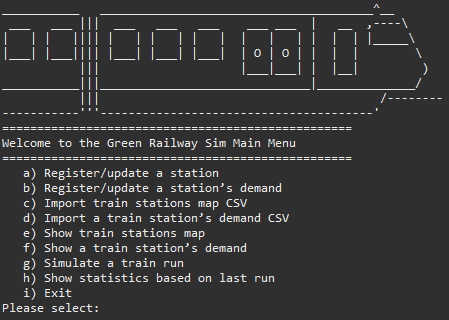

# Train Simulator CLI


This terminal-based train simulator provides a simulated command-line experience of a train operating along Melbourne’s Pakenham line. Built in Java with Eclipse and thoroughly tested using JUnit, the simulator derives passenger count data from CSV files and offers train customisation and statistical reporting.

---

## Main Menu



---

## Features

- **Line Simulation:** Simulates the Pakenham line from Flinders Street to Pakenham, including intermediate stations.
- **Train Configuration:** Create and delete train carriages, toggle direction and train line of choice.
- **Station Configuration:** Edit the passenger demand for each platform. For each time session of the day, add or remove station platforms.
- **Passenger Data:** Read and parse CSV files containing historical passenger counts per station, per hour.
- **Custom Schedules:** Define time session, each with their own data.
- **Real-time Statistics:** Display on-demand stats such as CO2 Emissions (overall and specific to train sections — locomotives/carriages), passengers left behind, total passengers carried, and the number of complaints.
- **JUnit Test Suite:** Comprehensive automated tests covering core functionality, data parsing, and statistical calculations.

> [!NOTE]  
> The train line does not contain every station.

---

## Technology Stack

- **Language:** Java 11+
- **IDE:** Eclipse IDE 2024-06 or later
- **Build & Dependency:** Maven or Gradle (configurable)
- **Testing:** JUnit 5
- **Data:** CSV files for passenger counts

---

## Installation

### 1️⃣ Clone the repository

```bash
git clone https://github.com/<s4096770>/train-simulator-cli.git
cd train-simulator-cli

2. Import into Eclipse

• Open Eclipse IDE.  
• File → Import → Existing Maven/Gradle Project.  
• Select the cloned directory.

3. Build & Run

• Use `mvn clean install` or your IDE’s build function.  
• Run the `Main.java` class from the `src/trainSimulation` folder.

---

## Usage

1. **Loading Passenger Data**

Select **c)** *Import train stations map CSV*, and then **a)** *Import CSV from File* to import the train line.  
Return to the Main Menu.  
Select **d)** *Import a train station’s demand CSV*, and then **a)** *Import CSV from File* to import the demand of each station (number of passengers).

2. **Creating a Train**

Select **g)** *Simulate a train run* to view options for the simulation.  
Select **a)** *Add/remove a carriage* to configure the size of the train.

3. **Configuring the Train Line and Direction**

Select **b)** *Specify line and direction*.

4. **Configuring the Time of Day**

Select **c)** *Specify time session*.

5. **Running the Simulation**

Select **d)** *Run sim*.

6. **Viewing Statistics**

Select **h)** *Show statistics based on last run*.

---

## Testing

All tests were created and executed using the Eclipse IDE’s built-in JUnit support (JUnit 5).  
To run the test suite:

1. Open the project in Eclipse.  
2. Navigate to the `src/trainSimulation/Tests.java` file.  
3. Right-click on the test file.  
4. Select **Run As → JUnit Test**.

---

## Project Structure

Train-Simulator-CLI/
│
├─ src/
│ └─ trainSimulation/ # Controller logic for routes
│ ├─ Carriage.java # Carriage object, handles passenger count (traversing)
│ ├─ CSVReader.java # Manages the reading and processing of all external CSV files
│ ├─ Locomotive.java # Train engine object
│ ├─ Main.java # Entry point of the console program
│ ├─ Menu.java # Handler for each menu screen/prompt
│ ├─ Platform.java # Platform object for train stations, handles passenger count
│ ├─ SimulationData.java # Last simulation statistics handler
│ ├─ Tests.java # JUnit tests
│ ├─ Train.java # Train object, handles carriages and locomotives
│ ├─ TrainLine.java # Handles multiple routes of a single train line
│ ├─ TrainRoute.java # Handles the journey of the train (station order)
│ ├─ TrainStation.java # Train station object, handles respective platforms
│ └─ TrainSystem.java # Handles all registered train lines
│
├─ db/ # Directory containing train station CSV data
├─ readme-images/ # Contains Main-Menu.png + java-badge.svg
└─ README.md


---
